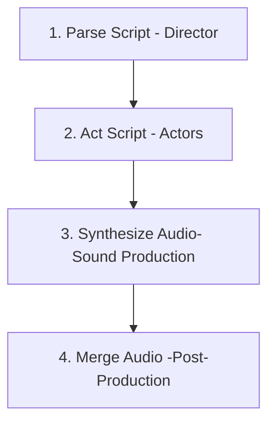

# Design Doc: Hệ thống Podcast AI

## Requirements

Hệ thống mô phỏng một quy trình sản xuất âm thanh như một đoàn làm phim. Nó nhận đầu vào là một file kịch bản dạng thô (văn bản tự do, không có cấu trúc JSON). Một "Đạo diễn AI" sẽ phân tích kịch bản, phân vai và gửi lời thoại cho các "Diễn viên AI" (LLM). Các diễn viên sẽ "diễn" lại lời thoại bằng cách thêm sắc thái, cảm xúc. Cuối cùng, hệ thống sử dụng API Text-to-Speech (TTS) để tạo ra file podcast MP3 hoàn chỉnh.

**User Stories:**
- **Người dùng:** Cung cấp một file `script.txt` với nội dung:
```
Tại một phòng tư vấn tâm lý...
```
 
- **Hệ thống:**
    1.  **Đạo diễn AI** đọc file `script.txt`, nhận diện được hai vai là "Chuyên gia tư vấn" và "Người cao tuổi", và bóc tách được lời thoại của từng người.
    2.  **Diễn viên AI (Chuyên gia)** nhận câu thoại "Chào bác, hôm nay bác cảm thấy thế nào?" và diễn lại thành: "Với giọng ấm áp và quan tâm, hãy nói: Chào bác, hôm nay bác cảm thấy thế nào ạ?"
    3.  **Diễn viên AI (Người cao tuổi)** nhận câu thoại "(Thở dài) Tôi thấy hơi mệt mỏi, chuyên gia ạ." và diễn lại thành: "Bắt đầu bằng một tiếng thở dài, rồi nói với giọng trầm và hơi mệt: Tôi thấy hơi mệt mỏi, chuyên gia ạ."
    4.  Hệ thống gọi API TTS của `thucchien.ai` để chuyển các câu thoại đã được "diễn" thành âm thanh.
    5.  Hệ thống ghép các file âm thanh lại và người dùng nhận được file `podcast.mp3`.

## Flow Design

### Applicable Design Pattern:

Hệ thống sử dụng mẫu **Workflow** (luồng công việc tuần tự) kết hợp với **MapReduce**.
1.  **Workflow**: Các bước được thực hiện tuần tự: Phân tích kịch bản -> Diễn xuất -> Tổng hợp âm thanh -> Ghép file.
2.  **MapReduce**:
    -   **Map**: Áp dụng song song hai quy trình (Diễn xuất và TTS) cho mỗi câu thoại đã được phân tích.
    -   **Reduce**: Ghép tất cả các file âm thanh thành một sản phẩm cuối cùng.

### Flow high-level Design:

1.  **ParseScriptNode (Đạo diễn AI)**: Đọc và phân tích kịch bản thô.
2.  **ActScriptNode (Diễn viên AI)**: LLM "diễn" lại từng câu thoại để thêm sắc thái.
3.  **SynthesizeAudioNode (Tổ sản xuất âm thanh)**: Chuyển đổi từng câu thoại đã "diễn" thành file âm thanh.
4.  **MergeAudioNode (Dựng phim)**: Hợp nhất các file âm thanh thành podcast cuối cùng.



## Utility Functions

1.  **Parse Raw Script** (`utils/parse_script.py`)
    -   *Input*: raw_script_content (str)
    -   *Output*: list of dicts `[{"role": "...", "dialogue": "..."}]`
    -   *Necessity*: Dùng cho `ParseScriptNode`. Hàm này sẽ sử dụng regex hoặc các phương pháp xử lý văn bản để nhận diện tên nhân vật và lời thoại tương ứng.

2.  **Call LLM** (`utils/call_llm.py`)
    -   *Input*: prompt (str), system_prompt (str)
    -   *Output*: response (str)
    -   *Necessity*: Dùng cho `ActScriptNode`.

3.  **Text to Speech Gemini** (`utils/tts_gemini.py`)
    -   *Input*: text_with_emotion (str), voice_name (str), output_path (str)
    -   *Output*: đường dẫn file âm thanh (str)
    -   *Necessity*: Dùng cho `SynthesizeAudioNode`.

4.  **Merge Audio Files** (`utils/merge_audio.py`)
    -   *Input*: audio_paths (list of str), output_path (str)
    -   *Output*: đường dẫn file podcast cuối cùng (str)
    -   *Necessity*: Dùng cho `MergeAudioNode`.

## Node Design

### Shared Store

```python
shared = {
    "input_script_path": "path/to/script.txt",
    "structured_script": [
        {"role": "Chuyên gia tư vấn", "dialogue": "Chào bác..."},
        {"role": "Người cao tuổi", "dialogue": "(Thở dài) Tôi thấy..."}
    ],
    "acted_script": [
        {"role": "Chuyên gia tư vấn", "acted_dialogue": "Với giọng ấm áp, hãy nói: Chào bác..."},
        {"role": "Người cao tuổi", "acted_dialogue": "Bắt đầu bằng tiếng thở dài, rồi nói..."}
    ],
    "audio_segments_paths": ["path/to/segment1.mp3", "path/to/segment2.mp3"],
    "final_podcast_path": "path/to/final_podcast.mp3"
}
```

### Node Steps

1.  **ParseScriptNode (Đạo diễn AI)**
    -   *Purpose*: Đọc file kịch bản thô và chuyển nó thành một cấu trúc dữ liệu có thể xử lý được.
    -   *Type*: Regular
    -   *Steps*:
        -   *prep*: Đọc nội dung từ file tại `shared["input_script_path"]`.
        -   *exec*: Gọi utility `parse_raw_script` để phân tích văn bản và bóc tách vai diễn, lời thoại.
        -   *post*: Lưu kết quả vào `shared["structured_script"]`.

2.  **ActScriptNode (Diễn viên AI)**
    -   *Purpose*: Sử dụng LLM để thêm hướng dẫn về cảm xúc/sắc thái vào mỗi câu thoại.
    -   *Type*: BatchNode
    -   *Steps*:
        -   *prep*: Đọc `shared["structured_script"]`.
        -   *exec (cho mỗi câu thoại)*:
            -   Xác định `system_prompt` dựa trên `role`.
                -   **System Prompt (Chuyên gia)**: "Bạn là một diễn viên lồng tiếng chuyên nghiệp, vào vai một chuyên gia tư vấn tâm lý. Nhiệm vụ của bạn là thêm các chỉ dẫn diễn xuất (ví dụ: 'nói một cách vui vẻ', 'nói với giọng trầm ngâm', 'ngừng một chút') vào câu thoại được cung cấp để nó nghe tự nhiên và truyền cảm nhất."
                -   **System Prompt (Người cao tuổi)**: "Bạn là một diễn viên lồng tiếng chuyên nghiệp, vào vai một người cao tuổi. Nhiệm vụ của bạn là thêm các chỉ dẫn diễn xuất (ví dụ: 'nói một cách mệt mỏi', 'thở dài', 'nói với giọng hoài niệm') vào câu thoại được cung cấp để nó thể hiện đúng tâm trạng của nhân vật."
            -   Gọi `call_llm` với prompt: `Hãy diễn lại câu thoại sau: "{dialogue}"`
        -   *post*: Lưu kết quả vào `shared["acted_script"]`.

3.  **SynthesizeAudioNode (Tổ sản xuất âm thanh)**
    -   *Purpose*: Chuyển đổi mỗi câu thoại đã "diễn" thành file âm thanh.
    -   *Type*: BatchNode
    -   *Steps*:
        -   *prep*: Đọc `shared["acted_script"]`.
        -   *exec (cho mỗi câu thoại)*:
            -   Xác định `voice_name` dựa trên `role`.
            -   Gọi utility `tts_gemini` với `acted_dialogue` và `voice_name`.
        -   *post*: Thu thập đường dẫn các file âm thanh và lưu vào `shared["audio_segments_paths"]`.

4.  **MergeAudioNode (Dựng phim)**
    -   *Purpose*: Ghép các file âm thanh thành một file podcast duy nhất.
    -   *Type*: Regular
    -   *Steps*:
        -   *prep*: Đọc `shared["audio_segments_paths"]`.
        -   *exec*: Gọi utility `merge_audio_files`.
        -   *post*: Lưu đường dẫn file podcast cuối cùng vào `shared["final_podcast_path"]`.